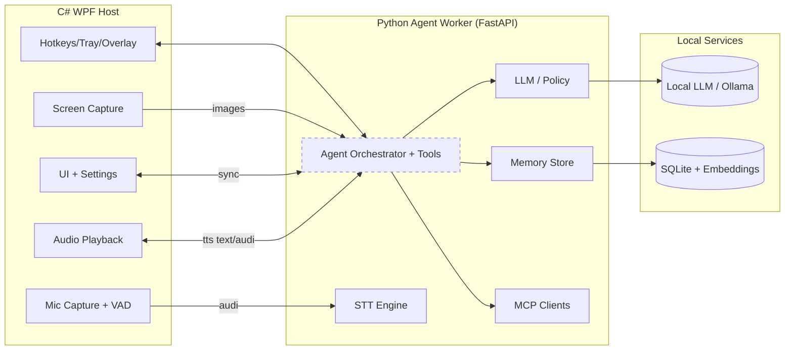

# ARCHITECTURE — Windows Desktop Assistant

## Scope and Goals
- Windows-first assistant with minimal UI (tray + overlay) and hotkey control.
- Two processes: C# WPF Host (existing shell) and Python Agent Worker (to be implemented).
- Support modalities: chat, talk (VAD-driven), screen share snapshots, settings management.
- Local-first, offline-friendly; IPC on localhost; security and privacy by default.

## High-Level Architecture


## Modalities & UX
- Talk: user presses/holds mic hotkey/button; host captures PCM; VAD stops on silence; host uploads audio; agent transcribes; agent responds with text and speak flag; host plays TTS (phase 1 text-to-speech on host).
- Chat: text input in overlay; show last N turns; send to agent; render rich text with action hints.
- Share Screen: user toggles permission; host captures snapshots (WinRT Graphics Capture) on interval (e.g., 1–2s) or on-demand; send to agent; agent may summarize or use vision; results shown inline.
- Settings: minimal UI for MCP server management, voice settings, hotkeys, startup behavior, model selection; host persists locally and syncs to agent on change.

## Responsibilities Split
- Host (C# WPF):
  - Hotkeys, tray icon, overlay rendering, focus handling.
  - Mic capture (WASAPI), VAD (WebRTC preferred; Silero optional), audio chunking.
  - Screen capture (Windows Graphics Capture), snapshot scheduling, redaction hooks.
  - Audio playback (NAudio preferred for stability/device control).
  - Settings UI and local storage (JSON; migrate to SQLite later).
  - Permission gates (mic, screen); enforce action execution (open URL, clipboard).
  - UI cache for last N messages; health indicator of agent.
- Agent (Python FastAPI):
  - Conversation state keyed by session_id; turn routing and orchestration.
  - STT (whisper.cpp or faster-whisper) on received audio bytes.
  - LLM calls (Ollama recommended initially; swappable).
  - Tooling via MCP clients; action suggestion generation.
  - Memory management (short-term context + long-term in SQLite + optional embeddings).
  - TTS: phase 1 host performs TTS from agent text; phase 2 agent may return audio bytes.

### STT/TTS by Phase
- Phase 1: Host captures audio → Agent performs STT → Agent returns text + speak flag/tts_text → Host plays TTS from text.
- Phase 2 (optional): Agent can generate audio bytes; host only plays returned audio; fallback to phase 1 text playback path remains.

## IPC Contract (Phase 1: localhost HTTP; Phase 2: optional named pipes/gRPC)
- Transport:
  - Phase 1: FastAPI on 127.0.0.1 with JSON for text/endpoints; multipart or octet-stream for audio/images.
  - Phase 2 option: switch to named pipes or gRPC for stricter local exposure and typed contracts.
- Core endpoints:
  - `GET /health` → `{ status, agent_version, model_status }`
  - `POST /session/start` → `{ session_id, created_at }`
  - `POST /input/text` (JSON) → `{ session_id, turn_id, text, input_meta }`
  - `POST /input/audio` (binary or multipart) → header/query/body `{ session_id, turn_id, sample_rate, format, input_meta }`
  - `POST /input/screen` (binary image) → `{ session_id, turn_id, capture_ts, input_meta }`
  - `GET /session/{id}/history?limit=N` → `{ session_id, messages: [...] }`
  - `POST /settings/sync` → `{ settings_version, settings_payload }`

### Shared JSON Fields
- `session_id` (string, UUID-ish), `turn_id` (string), `timestamp` (ISO8601 UTC).
- `input_meta`: `{ active_app?, window_title?, clipboard?, screen_share_enabled?, language? }`.
- Agent response envelope:
  ```json
  {
    "session_id": "s-123",
    "turn_id": "t-456",
    "messages": [
      { "role": "assistant", "content": "text/markdown", "actions": [], "ui_hints": {} }
    ],
    "speak": true,
    "tts_text": "Here is your answer",
    "tts_audio_b64": null,
    "display_history": { "messages": [...] },
    "diagnostics": { "latency_ms": 1200 }
  }
  ```

### Action Model (suggestions; host enforces)
- Actions are advisory; host prompts/permits before execution.
- Action schema:
  ```json
  {
    "type": "overlay_toast" | "copy_to_clipboard" | "open_url" | "mcp_call" | "run_command" | "show_link",
    "payload": { "text"?: "...", "url"?: "...", "tool"?: "...", "args"?: {} },
    "requires_confirmation": true
  }
  ```

## Sequence Diagrams

### Chat Turn
```mermaid
sequenceDiagram
  participant User
  participant Host
  participant Agent
  participant LLM
  User->>Host: Type message + submit
  Host->>Agent: POST /input/text {session_id, turn_id, text, meta}
  Agent->>LLM: Generate reply (with tools/MCP as needed)
  LLM-->>Agent: Text response
  Agent-->>Host: Response {messages, speak flag/tts_text}
  Host-->>User: Render text; play TTS if speak==true
```

### Talk Turn (VAD → STT → Response → TTS)
```mermaid
sequenceDiagram
  participant User
  participant Host
  participant Agent
  participant STT as STT Engine
  participant LLM
  User->>Host: Press/hold mic (hotkey)
  Host->>Host: Capture PCM; VAD detects silence end
  Host->>Agent: POST /input/audio {session_id, turn_id} + audio bytes
  Agent->>STT: Transcribe audio
  STT-->>Agent: Transcript text
  Agent->>LLM: Generate reply
  LLM-->>Agent: Text response
  Agent-->>Host: {messages, speak flag, tts_text}
  Host-->>User: Render text; TTS playback
```

### Screen Share Toggle + Snapshot + Summary
```mermaid
sequenceDiagram
  participant User
  participant Host
  participant Agent
  participant LLM
  User->>Host: Toggle screen share ON
  Host->>Host: Start periodic capture (with permission)
  loop interval/on-demand
    Host->>Agent: POST /input/screen {session_id, turn_id} + image bytes
    Agent->>LLM: Vision-enabled summarization
    LLM-->>Agent: Summary text/actions
    Agent-->>Host: {messages, speak?, ui_hints}
    Host-->>User: Update overlay with summary; optional toast
  end
```

## Tech Stack Recommendations
- Host (Windows):
  - .NET 8 WPF; MVVM for overlay/tray shell.
  - Audio capture: WASAPI via NAudio; VAD: WebRTC VAD (preferred) or Silero.
  - Playback: NAudio (device control, latency tuning).
  - Screen: Windows Graphics Capture (WinRT); encode PNG/JPEG/WebP.
  - Settings: JSON file now; migrate to SQLite later.
- Agent Worker:
  - FastAPI (uvicorn) on 127.0.0.1.
  - Orchestration: minimal custom agent loop; optional LangGraph later.
  - STT: faster-whisper (default) or whisper.cpp binary; batching optional.
  - LLM: Ollama initial; abstraction for provider swap.
  - Memory: SQLite; optional FAISS/embeddings later.
  - MCP client layer for tool calls; sandboxed execution by host policy.

## State & Memory
- Conversation state: lives in Agent, keyed by `session_id`; host caches only last N turns for UI.
- Memory tiers:
  - Short-term: recent turns in process memory.
  - Long-term: SQLite `agent/db/agent.db`; tables for sessions, messages, memory_chunks, embeddings (optional).
  - Opt-in embeddings: vector store (FAISS) gated behind config.
- Storage conventions:
  - Host settings: `%LOCALAPPDATA%/LISA/host-settings.json` (phase 1); future `%LOCALAPPDATA%/LISA/host.db`.
  - Agent data: `%LOCALAPPDATA%/LISA/agent.db`; media/cache under `%LOCALAPPDATA%/LISA/cache`.

## Folder Layout (repo root)
- `/host-win/` — C# WPF app.
  - `LISA.Host/App.xaml`, `MainWindow.xaml`, `Overlay/`, `Services/Audio/`, `Services/Capture/`, `Settings/`.
- `/agent/` — Python worker.
  - `main.py`, `api/routes.py`, `agent/orchestrator.py`, `agent/stt.py`, `agent/llm.py`, `agent/memory.py`, `config.py`.
- `/shared/` — schemas/contracts.
  - `schemas/ipc.json`, `schemas/actions.json`, `protos/` (future gRPC), `clients/csharp/`, `clients/python/`.
- `/docs/` — documentation and diagrams.
  - `ARCHITECTURE.md`, `diagrams/`.

## Security & Privacy
- Bind agent server to `127.0.0.1`; disable remote access.
- Rate limits and payload caps (e.g., audio ≤ 30s per request; images ≤ 1–2MB compressed).
- Redaction hooks for screen capture (blur regions, exclude windows); clipboard inclusion opt-in.
- Permission gates in host for mic and screen; explicit toggle for screen share.
- Actions require confirmation; host maintains allowlist; future: signed actions or per-tool scopes.

## Observability
- Logging:
  - Host: structured logs with correlation IDs (`session_id`, `turn_id`); file under `%LOCALAPPDATA%/LISA/logs/host.log`.
  - Agent: uvicorn + application logs with correlation IDs; `%LOCALAPPDATA%/LISA/logs/agent.log`.
- Metrics (lightweight): latency per turn, STT duration, LLM duration, payload sizes.
- Event timeline: per-turn trace persisted in agent DB for debugging.

## Implementation Phases
- Phase 0 (done): WPF shell, tray, overlay, hotkey, health indicator stub.
- Phase 1: Chat end-to-end (text input → agent → LLM via Ollama → history retrieval).
- Phase 2: Talk mode — mic capture, VAD, POST /input/audio, STT, host TTS playback.
- Phase 3: Screen share snapshots — capture, send images, vision summary in responses.
- Phase 4: Settings UI + MCP management — sync settings, manage MCP servers, model/provider selection.
- Phase 5: Memory + embeddings — long-term recall via SQLite + optional FAISS vectors.
