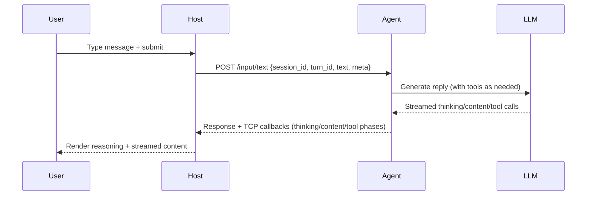

# ARCHITECTURE - Windows Desktop Assistant

## Scope and Goals
- Windows-first assistant with minimal UI (tray + overlay) and hotkey control.
- Services: C# WPF Host (existing shell), Python Agent Worker, and Python Agent.MCP tool server.
- Support modalities: chat, talk (VAD-driven), screen share snapshots, settings management.
- Local-first, offline-friendly; IPC on localhost; security and privacy by default.

## High-Level Architecture
```mermaid
flowchart LR
  subgraph Host["C# WPF Host"]
    HK[Hotkeys/Tray/Overlay]
    MIC[Mic Capture + VAD]
    SC[Screen Capture]
    UI[UI + Settings]
    PB[Audio Playback]
  end
  subgraph Agent["Python Agent Worker (FastAPI)"]
    ORCH[Agent Orchestrator + Tools]
    RESP[LLM / Policy]
    MEM[Memory Store]
    MCPCLI[MCP Clients]
  end
  subgraph MCP["Python Agent.MCP (FastAPI)"]
    TOOLING[System / Process / File Tools]
  end
  subgraph Infra["Local Services"]
    LLM[(Local LLM / Provider)]
    DB[(SQLite (FTS))]
  end

  HK <---> ORCH:::ipc
  MIC --audio--> ORCH
  SC --images--> ORCH
  UI <--sync--> ORCH
  PB <--tts text/audio--> ORCH
  ORCH --> RESP --> LLM
  ORCH --> MCPCLI --> MCP
  ORCH --> MEM --> DB

  classDef ipc stroke-dasharray: 5 5;
```

## Modalities & UX
- Talk: user presses/holds mic; host captures PCM; VAD stops on silence; host uploads audio; agent transcribes; agent responds with text and speak flag; host plays TTS via external Piper process (GPL, no embedding or redistribution).
- Chat: text input in overlay; show history; send to agent; render markdown; show tool/stream status; copy/retry/stop per message.
- Share Screen: user arms Share; the next Chat/Talk prompt captures a one-shot screenshot (host briefly hides the overlay), uploads it to the agent (`POST /visual-context/frame`), and the agent attaches it to the next LLM request (vision-capable models).
- Settings: MCP servers, voice settings, hotkeys, startup, provider selection; stored locally and synced to agent.
- Streaming UX: reasoning streamed separately; content streamed live; tool-call phases surfaced (awaiting/processing/complete).

## Responsibilities Split
- Host (C# WPF):
  - Hotkeys, tray, overlay rendering, focus.
  - Mic capture (WASAPI), VAD, screen capture (currently GDI `CopyFromScreen`; WinRT capture is a future upgrade).
  - Audio playback (NAudio), permission gates, clipboard/open-url enforcement.
  - Settings UI + storage (`%LOCALAPPDATA%/LISA/host-settings.json`).
  - UI cache for messages; health indicators for MCP/Agent/Provider; local TCP listener for streaming callbacks.
- Agent (Python FastAPI):
  - Conversation state keyed by `session_id`.
  - LLM calls (Ollama/provider), tools via MCP client, orchestration.
  - System context injected every request: LISA prompt + metadata (time, user display/account, machine, OS, locale/region, home).
  - Tool registry: fetched on startup and cached; injected as tools property and first-system message once per session.
- Streaming callbacks (TCP, persistent connection): thinking, content chunks/done, tool phases with token + per-session nonce validation.
  - Memory: short-term in process; long-term planned in SQLite + optional embeddings.
  - STT/TTS: STT in agent (future); host plays TTS from agent text via external Piper process (GPL boundary; subprocess only).
- Agent.MCP (Python FastAPI):
  - `/tools` (name/description) and `/call` to execute tools.
  - Tooling: system state (CPU/RAM/disk/network/battery/uptime), process/app inspector, file/disk (large files, duplicates, disk by extension, recent changes, metadata).

### STT/TTS by Phase
- Phase 1: Host captures audio -> Agent performs STT -> Agent returns text + speak flag/tts_text -> Host plays TTS via Piper as an external process (GPL isolation; no linked/embedded Piper).
- Phase 2 (optional): Agent can return audio bytes; host only plays returned audio.

## IPC Contract (Phase 1: localhost HTTP; Phase 2: optional pipes/gRPC)
- Transport:
  - Phase 1: FastAPI on 127.0.0.1 with JSON; multipart/octet-stream for audio/images; persistent TCP callbacks for thinking/content/tool phases to host.
  - Phase 2 option: named pipes or gRPC for tighter surface and typed contracts.
- Core endpoints:
  - `GET /health`
  - `POST /input/text`
  - `POST /input/audio`
  - `POST /input/retry`
  - `POST /tool/approval`
  - `POST /visual-context/frame`

### Shared JSON Fields
- `session_id`, `turn_id`, `timestamp`.
- `input_meta`: `{ active_app?, window_title?, clipboard?, screen_share_enabled?, language? }`.
- Agent response envelope:
  ```json
  {
    "session_id": "s-123",
    "turn_id": "t-456",
    "messages": [{ "role": "assistant", "content": "text/markdown" }],
    "speak": false,
    "tts_text": null,
    "tool_calls": ["tool_a"],
    "reasoning": "optional reasoning",
    "thinking_ms": 4200
  }
  ```

### Action Model (suggestions; host enforces)
```json
{
  "type": "overlay_toast" | "copy_to_clipboard" | "open_url" | "mcp_call" | "run_command" | "show_link",
  "payload": { "text"?: "...", "url"?: "...", "tool"?: "...", "args"?: {} },
  "requires_confirmation": true
}
```

## Sequence Diagrams

### Chat Turn


### Talk Turn (Phase 1)
```mermaid
sequenceDiagram
  participant User
  participant Host
  participant Agent
  participant STT as STT Engine
  participant LLM
  User->>Host: Press/hold mic
  Host->>Host: Capture PCM; VAD stops on silence
  Host->>Agent: POST /input/audio {session_id, turn_id} + audio bytes
  Agent->>STT: Transcribe
  STT-->>Agent: Transcript
  Agent->>LLM: Generate reply
  LLM-->>Agent: Reply
  Agent-->>Host: {messages, speak, tts_text}
  Host-->>User: Render + TTS playback
```

### Screen Share Toggle + Snapshot
```mermaid
sequenceDiagram
  participant User
  participant Host
  participant Agent
  participant LLM
  User->>Host: Arm Share
  User->>Host: Send prompt (Chat or Talk transcript)
  Host->>Host: Briefly hide overlay; capture screenshot
  Host->>Agent: POST /visual-context/frame {session_id, image}
  Host->>Agent: POST /input/text {session_id, turn_id, text}
  Agent->>LLM: Vision + response (image attached)
  LLM-->>Agent: Streamed content/thinking/tool calls
  Agent-->>Host: TCP callbacks + response
  Host-->>User: Render streamed content
```

## Tech Stack
- Host: .NET 8 WPF, MVVM; WASAPI capture; VAD; screen capture via GDI `CopyFromScreen` (one-shot in Share); NAudio playback; Piper via external process only (GPL, user-installed); JSON settings.
- Agent Worker: FastAPI; Ollama/provider; MCP client; TCP callbacks; system context builder; prompts as markdown files; MCP auth token injected at startup to warm tool cache.
- Agent.MCP: FastAPI tools server; PowerShell/WMI under the hood; read-only tools.

## State & Memory
- Conversation lives in Agent (by `session_id`); host caches last N for UI.
- Agent trims history by approximate token cap and max message count.
- Memory tiers:
  - Short-term: in-process conversation history (per `session_id`).
  - Long-term (opt-in): SQLite at `%LOCALAPPDATA%/LISA/memory.db` with FTS (when available) + LIKE fallback; retrieved per prompt and injected as a `Long-term memory:` system message with `[mem] key = value` lines.
- Memory writes are non-blocking:
  - The assistant appends a hidden trailer `<lisa_memory>{...}</lisa_memory>` to the end of its response.
  - `Agent.Worker` strips it from the user-visible text, minimally validates ops (non-secret, bounded size), then writes to SQLite asynchronously and emits `memory_update_*` callbacks for UI.
  - If no relevant memory is found for a prompt, the agent injects a “none found; do not guess personal facts” instruction to reduce hallucinations on recall questions.
- Storage: host settings at `%LOCALAPPDATA%/LISA/host-settings.json`; agent cache/data under `%LOCALAPPDATA%/LISA/`.

## Folder Layout (repo)
- `/Host.Win/` - WPF host (tray/overlay, settings, chat UI, status chips).
- `/Agent.Worker/` - FastAPI agent (LLM, tools, prompts, system context).
- `/Agent.MCP/` - MCP tools server (system/process/file tools).
- `/docs/` - architecture and diagrams.

## Security & Privacy
- Bind servers to `127.0.0.1`; no remote exposure.
- Payload caps (audio and images) enforced by host and agent.
- Provider API keys stored encrypted at rest (DPAPI CurrentUser).
- Redaction hooks for screen/clipboard; permission gates for mic/screen.
- Actions are suggestions; host enforces confirmation/allowlist. Future: signed actions/tool scopes.

## Security Improvements (ongoing)
- IPC hardening: authenticated callbacks (token + per-session nonce) and MCP auth tokens; loopback binding enforcement next.
- Secrets: DPAPI at-rest encryption, log redaction, and fail-closed settings saves.
- Tooling: per-tool allowlists, audit logs, and explicit user confirmations (planned).

## Observability
- Host logging + agent logging with correlation IDs (`session_id`, `turn_id`).
- TCP callbacks mark thinking/content/tool phases for live UX.
- Minimal metrics: latency per turn, provider latency, payload sizes; event timeline per turn (planned in DB).

## Implementation Phases
- Phase 0 (done): WPF shell, tray, overlay, hotkey, health indicator stub.
- Phase 1 (done): Chat end-to-end with streaming (content + reasoning), tool calls via Agent.MCP, system prompt + metadata injection, copy/retry/stop, status chips (MCP/Agent/Provider).
- Phase 2 (done): Talk mode - mic capture, VAD, POST /input/audio, STT, host TTS playback.
- Phase 3: Screen share snapshots - capture, send images, vision summary in responses.
- Phase 4: Memory (opt-in) - long-term recall via SQLite + FTS, auto-saves via hidden JSON trailer, UI indicator + controls.
- Phase 5: Installer, polish, and optional hybrid retrieval (lexical + embeddings).
