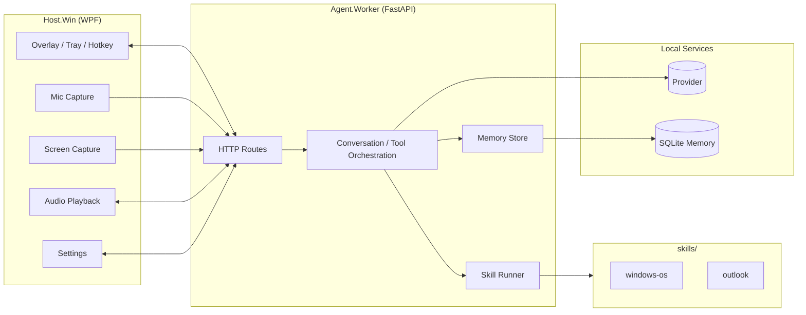

# Architecture

## Overview

LISA is a local Windows assistant built from four runtime layers:

1. `Host.Win`
2. `Agent.Worker`
3. `skills/`
4. local storage / local provider

The active runtime is skills-first.

## Topology

## Responsibilities

### Host.Win

- tray icon
- global hotkey
- overlay rendering
- chat/talk/share/settings UI
- mic capture
- one-shot screen capture
- audio playback
- local settings persistence
- health/status indicators
- TCP callback receiver for streamed phases

### Agent.Worker

- FastAPI routes
- conversation state
- prompt assembly
- provider calls
- skill/tool selection
- skill subprocess execution
- memory retrieval and async memory writes
- streaming callbacks back to host

### skills/

Each skill folder is repo-local and self-contained.

Required:

- `SKILL.md`
- `tools.json`

Optional:

- `scripts/`
- `references/`
- `assets/`
- `agents/openai.yaml`

Current live categories:

- `skills/windows-os`
- `skills/outlook`

## Tool Execution Model

Tool execution is CLI-based.

### Discovery

- `Agent.Worker` scans `skills/*/SKILL.md`
- `tools.json` is loaded per skill
- the tool registry is cached and exposed to the orchestration layer

### Invocation

- the agent selects a tool
- the skill runner launches a repo-local Python command
- input is passed as JSON on stdin
- output is returned as JSON on stdout

### Constraints

- repo-local commands only
- Python entrypoints only for v1
- bounded stdout
- timeout per tool
- sanitized subprocess environment

## HTTP Surface

Primary routes:

- `GET /health`
- `GET /ready`
- `POST /input/text`
- `POST /input/retry`
- `POST /input/audio`
- `POST /visual-context/frame`
- `POST /tool/approval`
- `POST /memory/clear`

## Streaming Model

The agent streams live state back to the host over the callback channel.

Phases include:

- `thinking_chunk`
- `thinking_done`
- `content_chunk`
- `content_done`
- `tool_approval_required`
- `tool_auto_approved`
- `awaiting_tool`
- `tool_response`
- `tool_complete`
- `tool_rejected`
- `memory_update_started`
- `memory_update_done`
- `memory_update_failed`

## Speech

### STT

- `whisper.cpp` is the preferred low-latency local STT backend when configured
- faster-whisper remains a fallback path where available

### TTS

- host playback is local
- the current setup supports the existing Chatterbox/Piper-compatible flows depending on local configuration

## Memory

Long-term memory is local and opt-in.

- storage: SQLite in `%LOCALAPPDATA%/LISA/`
- retrieval: lexical lookup before provider calls
- writes: async, extracted from hidden memory trailers
- UI: host receives memory update callbacks and surfaces lightweight status

## Share

Share is intentionally bounded.

- user arms Share
- next prompt captures one screenshot
- screenshot is attached to that turn only
- overlay is briefly hidden/minimized during capture
- share auto-disarms after the request

## Security Boundaries

Current enforced boundaries:

- loopback-only runtime
- repo-local skill execution
- Python-only skill entrypoints for v1
- settings API key encryption at rest via DPAPI

Still requiring dedicated hardening:

- explicit auth policy for all agent routes
- tighter allowlist around subprocess environment and command shape
- cleanup of remaining legacy assumptions in non-runtime docs/logging
